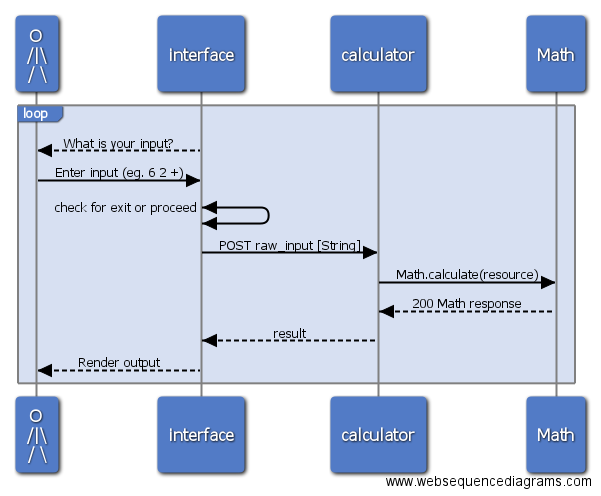

# RPN Calculator Exercise
## Overview
A command-line calculator which uses reverse polish notation (RPN). Reverse Polish notation (RPN) is a mathematical notation in which every operator follows all of its operands, in contrast to Polish notation (PN), which puts the operator before its operands. It is also known as postfix notation. It does not need any parentheses as long as each operator has a fixed number of operands.

[project details](docs/proposal.md)

### For example:
```
=> 6 2 +
=> 8

=> 3 *
=> 18
```

## Dependencies
RPN Calculator has the following dependencies
1. Ruby Version 2.2.2
1. Bundler

## Basic Usage
execute `bundle exec ruby rpn_calculator.rb`

## Run Tests
RPN Calculator was built with the TDD model of development and uses RSPEC for verification.
`bundle exec rspec`

## Workflow

